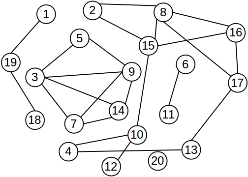

# ConnectedComponents

###Description
Given a graph, this algorithm identifies the [connected components](https://en.wikipedia.org/wiki/Connected_component_(graph_theory)) using Hadoop MapReduce framework.

In the following, a **connected component** will be called as **"cluster"**.

The algorithm tries to implement the *"The Alternating Algorithm"* proposed in the paper [Connected Components in MapReduce and Beyond](http://dl.acm.org/citation.cfm?id=2670997). Below, I have reported the pseudo-code of the algorithm.

```
	Input: Edges (u, v) as a set of key-value pairs <u; v>.
	Input: A unique label lv for every node v ∈ V .
1:	repeat
2:		Large-Star
3:		Small-Star
4:	until Convergence
```

###Demonstration
Below, it is shown a demonstration of usage of the **ConnectedComponents** class that allows you to run the connected component algorithm on your graph.<br />
This code simply creates a **ConnectedComponents** object, taking as input the graph and the output folder. Invoking the **run** method,  the algorithm will produce an hdfs file for each Reducer task, invoked by MapReduce framework, into the output folder. These files will contain the clusters found in the input graph.

```Java
package app;

import pad.ConnectedComponents;

public class App
{
	public static void main( String[] args ) throws Exception 
	{	
		// Create ConnectedComponents object giving an adjacency/cluster
		// list rappresenting the graph and the output folder as input
		ConnectedComponents cc = new ConnectedComponents( new Path("graph.txt"), new Path("out") );

		// Run all the Jobs necessary to compute the result 
		if ( !cc.run() )
			System.exit( 1 );

		System.exit( 0 );
	}
}
```

In this toy application, we don't work on the computed result. But you can invoke the **TranslatorDriver** as follwing:
```bash
HADOOP_HOME=/home/$USER/hadoop-1.2.1
WORKING_DIR=/home/$USER/Exercises-PAD/connectedComponents
JAR_PATH=$WORKING_DIR/target/connectedComponents-1.0-SNAPSHOT.jar
HADOOP=HADOOP_HOME/bin/hadoop
$HADOOP jar $JAR_PATH pad.TranslatorDriver Cluster2Text out outT 
```
where :

 - `$HADOOP_HOME`: indicates the path to the root directory of hadoop;
 - `$WORKING_DIR`: indicates the path to the directory where you have cloned the project;
 - `$JAR_PATH`: indicates where it is located the jar file.

This makes it possible to translate the result files in text and look which nodes compound the connected components.

Otherwise, of course, you can code a MapReduce Job to perform the operation that you are looking for taking as input the *"out"* folder.

###Compile
After you have cloned the project, to compile the program you'll need to use the following command lines:

```bash
cd ConnectedComponents
mvn package
```

###Usage
To run the program, you'll need to use the following command line:

```bash
$HADOOP jar target/connectedComponents-1.0-SNAPSHOT.jar app.App
```

### Input
In the [data](./data) folder, there are some graph examples that you can use to try this software. In that folder, there are a lot of files.<br />
You have to look up only to the one named as *input_${number}.txt*.<br />

The input file can contain:

1.	the **adjacency list** of the graph, i.e. multiple lines in the following format:
	```bash
	<NodeID><TAB><Neighborhood>
	```
	- `<NodeID>`: is a unique integer ID corresponding to an unique node of the graph.
	- `<Neighborhood>`: is a comma separated list of increasing unique IDs corresponding to the nodes of the graph that are linked to `<NodeID>`.

2.	the **cluster list** of the graph, i.e. multiple lines in the following format:
	```bash
	<NodeID1><SPACE><NodeID2><SPACE> ... <SPACE><NodeIDN>
	```
	indicating that al the nodes, `<NodeID1>` ... `<NodeIDN>` , are linked to each other.

### Output
The program will create a folder where the clusters found are stored.<br />
In particular the output files produced by the Reducer tasks are formatted by the `SequenceFileOutputFormat<pad.ClusterWritable, org.apache.hadoop.io.NullWritable>`, where `pad.ClusterWritable` represents an array of integers and is serialized writing on the output file its size and then its elements. Therefore, each output file has the following format:\\
```bash
	<Cluster1><Cluster2> ... <ClusterK>
```
where each *Cluster* is a sequence of increasing numbers which they compound a *connected component* of the input graph.

### Algorithm
Below, it is shown the pseudo-code of the algorithm I have implemented:

```
	Input: G = (V, E) represented with an adjacency list.
	Input: A unique and positive label lv for every node v ∈ V .
1:	Initialization_Phase
2:	repeat
3:		Large-Star
4:		Small-Star
5:	until Convergence
6:	Termination_Phase
7:	Check_Phase
```

Where:

- **Initialization_Phase**	→	Transform the adjacency/cluster list in a list of pairs `<NodeID><TAB><NeighborID>`
- **Termination_Phase**		→	Transform the list of pairs into sets of nodes ( *cluster files* )
- **Check_Phase**			→	Verify that no clusters is malformed

### Test the Software
In order to test this software, I have prepared some verification outputs in the [data](./data) folder, with the purpose to compare these handmande expected outputs with the software outputs.<br />
For example, you can test the following graph:



- *input_1.txt*				→	Contains the adjacency list of the graph shown in the picture.
- *init_1.txt*				→	Contains the expected result for the **Initialization_Phase** applied to *input_1.txt*.
- *large-star_1.txt*		→	Contains the expected result for the **Large-Star** operation applied to *input_1.txt*.
- *small-star_1.txt*		→	Contains the expected result for the **Small-Star** operation applied to *input_1.txt*.
- *term_1.txt*				→	It is the hand-made input for the **Termination_Phase**, in this way we can check the last phase without running all the algorithm.
- *cluster_1.txt*	→	Contains a line for each cluster found, and the set of nodes that compose each cluster are stored in ascending order. It is the final expected result, so it is the expected result for the **Termination_Phase** applied to *term_1.txt* and the expected result of the all algorithm as well.<br />
	The content of the file, in this case, is the following:

	```
	1 18 19
	20
	2 4 8 10 12 13 15 16 17
	3 5 7 9 14
	6 11
	```

In the [bin](./bin) folder, you can find a *bash script* that tests each phase for every appropriate input found in the [data](./data) folder. Pay attenction that for the *StarTest.sh* script, you need to specify the *type* of the operation as argument, like "small" or "large".

###License
Apache License

Copyright (c) 2015 Federico Conte

http://www.apache.org/licenses/LICENSE-2.0
