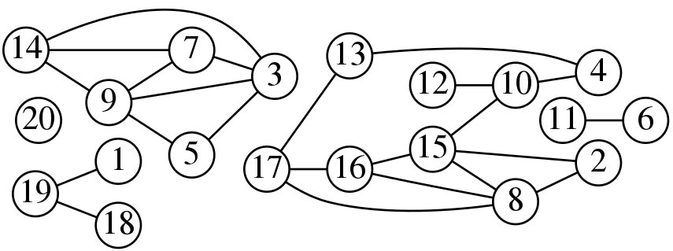

# ConnectedComponents

###Description
Given a graph, this algorithm identifies the [connected components](https://en.wikipedia.org/wiki/Connected_component_(graph_theory)) using Hadoop MapReduce framework.

It tries to implement the *"The Alternating Algorithm"* proposed in the paper [Connected Components in MapReduce and Beyond](http://dl.acm.org/citation.cfm?id=2670997). Below, I have reported the pseudocode of the algorithm.

```
	Input: Edges (u, v) as a set of key-value pairs <u; v>.
	Input: A unique label lv for every node v ∈ V .
1:	repeat
2:		Large-Star
3:		Small-Star
4:	until Convergence
```

###Demonstration
The **ConnectedComponents** class allows you to run the connected compontent algorithm on your graph, and obtain as a result an array of Cluster objects, contained in the **Clusters** class.<br />
Each **Cluster** manages an **hdfs file** where the nodes of the cluster are stored (i.e. the nodes of the connected component found in the graph). The **Cluster** class implements an **Integer Iterator**, so you can scan the cluster file node by node, as you were manipulating a normal iterator. Then, if you need to restart from the begining, you can call the **restart** method. It is a really expensive method, so use it carefully. <br />

Below is shown a demostration of usage of the **ConnectedComponents** class; as you can see, the **restart** method has to be called every time you want to reuse/re-scan the cluster. <br />
Pay attention to call the **destroy** method when you have finished to work with the clusters. In this way, we will leave the hdfs clean, since this method simply destory the folder where the clusters files are stored.

```Java
package test;

import pad.Cluster;
import pad.Clusters;
import pad.ConnectedComponents;

public class App
{
	public static void main( String[] args ) throws Exception 
	{
		// Create the ConnectedComponents object giving to it as input
		// an adjacency list rappresenting the graph stored in a file on hdfs
		ConnectedComponents cc = new ConnectedComponents( "graph.txt" );
		// Run all the Jobs necessary to compute the result 
		if ( !cc.run() )
			System.exit( 1 );
		
		// Get the result, i.e. the array of Cluster, and scan it
		Clusters clusters = cc.getResult();
		for ( Cluster cluster : clusters )
		{
			// Print the cluster on screen
			cluster.print();
			// Restart the iterator after have consumed the cluster file
			cluster.restart();
			
			// Search if the cluster file contains the nodeID 37
			if ( cluster.contains( 37 ) )
				System.out.println( "37 -> Cluster " + cluster.getID() );
			// We call restart again, since we have scanned the cluster file
			cluster.restart();
			
			// Use the Cluster object as a normal Iterator
			while ( cluster.hasNext() )
			{
				Integer nodeID = cluster.next();
				System.out.println( nodeID );
			}
		}
		
		// Destroy the folder where the clusters files are stored
		clusters.destroy();
		System.exit( 0 );
	}
}
```

###Compile
After you have cloned the project, to compile the program you'll need to use the following command lines:

```bash
cd ConnectedComponents
mvn package
```

###Usage
To run the program, you'll need to use the following command line:

```bash
$HADOOP_HOME/bin/hadoop jar target/connectedComponents-1.0-SNAPSHOT.jar test.App
```

where $HADOOP_HOME indicates the path to the root directory of hadoop.

### Input
In the [data](./data) folder, there are some graph examples that you can use to try this software. In that folder, there are a lot of files.<br />
You have to look up only to the one named as *input_${number}.txt*.<br />

The input file has to contains the adjacency list of the graph, i.e. multiple lines in the following format:

    <NodeID><TAB><Neighborhood>

- `<NodeID>`: is a unique integer ID corresponding to an unique node of the graph.
- `<Neighborhood>`: is a comma separated list of increasing unique IDs corresponding to the nodes of the graph that are linked to `<NodeID>`.

### Output
The program will create a folder, named *${input_name}_out*, where keeps a file for each cluster found.<br />
Each *cluster file*, that stores an **ordered list** of `<NodeID>`, is managed by the **Cluster** object that can compute operations on that file, as seen in the **Demonstration**.<br />
Calling the method **destroy** of the **Clusters** object, you can delete this working folder and leave the hdfs clean.

### Algorithm
The algorithm, that I have implemented, has some slight difference compared to the one proposed in the paper. Below, it is shown the pseudocode.

```
	Input: G = (V, E) rappresented with an adjacency list.
	Input: A unique and positive label lv for every node v ∈ V .
1:	Initialization_Phase
2:	repeat
3:		Large-Star
4:		Small-Star
5:	until Convergence
6:	Termination_Phase
7:	Checking_Phase
8:	Build_Result
```

Where:

- **Initialization_Phase**	→	Transform the adjacency list in a list of pairs `<NodeID><TAB><NeighborID>`
- **Termination_Phase**		→	Transform the list of pairs into sets of nodes ( *cluster files* )
- **Checking_Phase**		→	Check if the *cluster files* are well formed.
- **Build_Result**			→	If there are no problems, it build the **Clusters** object giving to it the folder where the *cluster files* are stored.

### Test the Software
In order to test this software, I have prepared some verification outputs in the [data](./data) folder, with the purpose to compare these handmande expected outputs with the software outputs.<br />
For example, you can test the following graph:



- *input_1.txt*				→	Contains the adjacency list of the graph shown in the picture.
- *init_1.txt*				→	Contains the expected result of the **Initialization_Phase** applied to *input_1.txt*.
- *large-star_1.txt*		→	Contains the expected result of the *Large-Star* operation applied to *input_1.txt*.
- *small-star_1.txt*		→	Contains the expected result of the *Small-Star* operation applied to *input_1.txt*.
- *term_1.txt*				→	It is the hand-made input for the **Termination_Phase**, in this way we can check the last phase without running all the algorithm.
- *output_1_cluster_$i.txt*	→	In this case we have **5** hand-made *cluster files* ( from *output_1_custer_0.txt* to *output_1_custer_4.txt* ). They are the expected results of the **Termination_Phase + Checking_Phase**. 
- *final_output_1.txt*		→	If we run all the algorithm, giving as input *input_1.txt*, and then we print the Clusers found, we expect to have the following output (i.e. the content of this file) :

```
Cluster[0] = { 1,18,19 }
Cluster[1] = { 2,4,8,10,12,13,15,16,17 }
Cluster[2] = { 20 }
Cluster[3] = { 3,5,7,9,14 }
Cluster[4] = { 6,11 }
```

In the [bin](./bin) folder, you can find a *bash script* that tests each phase for every appropriate input found in the [data](./data) folder. Pay attenction that for the *StarTest.sh* script, you need to specify the *type* of the operation as argument, like "small" or "large".<br />
Also, verify that at least the **$HADOOP_HOME** and **$WORKING_DIR** variables are appropriately set.<br />
In my case they have the following values :

```
HADOOP_HOME=/home/$USER/hadoop-1.2.1
WORKING_DIR=/home/$USER/Exercises-PAD/connectedComponents
```

## Issues

### Issue of Convergence
The [paper](http://dl.acm.org/citation.cfm?id=2670997) says that the *"The Alternating Algorithm"* must converge after **2(n − 1) rounds**.
But running almost **4n** Jobs, it seems to me realy realy too expensive.<br />
In the paper, it also said that the *"The Alternating Algorithm"* takes **O(log n) rounds** on the bad example, but they have no proved that this is always the case.<br />
In my small examples, I have found that **log2(n) rounds** are enough to compute the connected components.<br />
After the cycle the **Termination_Phase** and the **Checking_Phase** takes place; in particular, the **Checking_Phase** report an **error** if it founds the cluster malformed.<br />
So, it is possible that with some graph, this algorithm cannot compute the result.

In order to solve this problem, I have thoughts to the following possible solutions:

1. Cycling until **Termination_Phase + Checking_Phase** do not return that the clusters are well-formed.
2. Cycling **log2(n) rounds**, and if the **Termination_Phase + Checking_Phase** return that the clusters are malformed, repeat the cycle.

I'm waiting to decide which one apply and how can I make it more efficient.<br />
It will be cool to do the **Termination_Phase + Checking_Phase** in just one fast Job. In this case the first solution will be surely prefered.

### Issue of Dirty Output
When the user call `cc.run()` the method prints on the screen *INFO* and *WARNING* messages from the hadoop Job execution.<br />
For this reason in the *ConnectedComponentsTest.sh* script, I am forced to to the following command, in order to obtain the expected result:

```
echo "Cluster$res" | sed 's/}/}\n/g' | grep -e "Cluster" > $DATASET/$final_output_file.
```

I have tried to solve this problem setting the logging level, `LOG.setLevel( Level.ERROR );`, in every Mapper and Reducer tasks; but nothing changed.<br />
I have never used *logging* in Java, so probably I should better document myself in order to solve this problem.

###License
Apache License

Copyright (c) 2015 Federico Conte

http://www.apache.org/licenses/LICENSE-2.0
